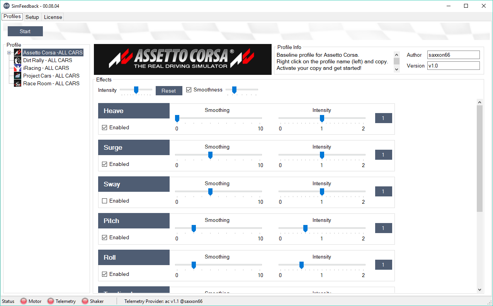
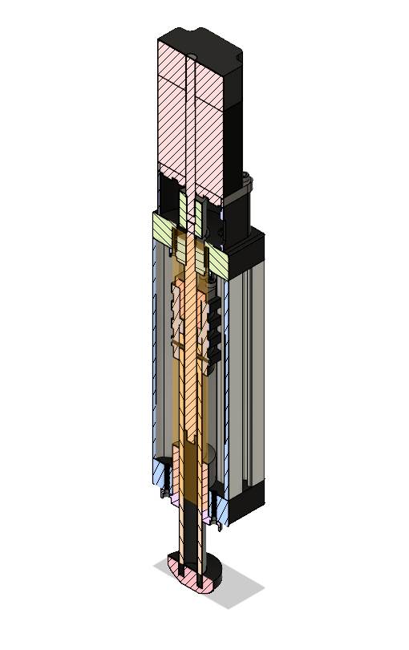

# SimFeedback-AC-Servo

## SimFeedback AC Servo Version - Virtual Racing Motion Simulator 

SimFeedback is a PC software, that will receive telemetry data from Racing games/simulations like iRacing, Assetto Corsa, Project Cars, ... . This data is used to create motion cues by transforming them into motion commands.

In this Version, motion commands will be send to a mirco controller (Arduino based) that will control closed loop AC Servos.

We will show you how to build the SFX-100 DIY actuators, the Electronics, the Software and get all of this up and running.

Have a look in the [Wiki](../../wiki)

Or get in contact ...

https://forum.virtualracing.org/showthread.php/109282-DIY-3KW-Motion-Sim-Rig-Coming-Soon

https://www.racedepartment.com/threads/the-simfeedback-ac-diy-motion-simulator-thread.159524/

http://members.iracing.com/jforum/posts/list/3616928.page

Here is a great build blog from Rowan 
https://www.rowanhick.com/sfx-100-build-and-running-guide

SimFeedback and SFX-100 in action 

### SimFeedback Software

### SFX-100 Linear Actuator Design

